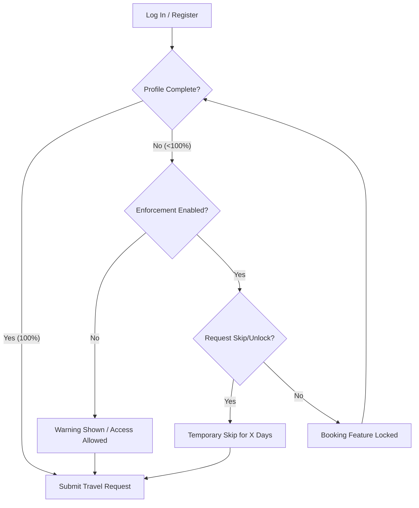
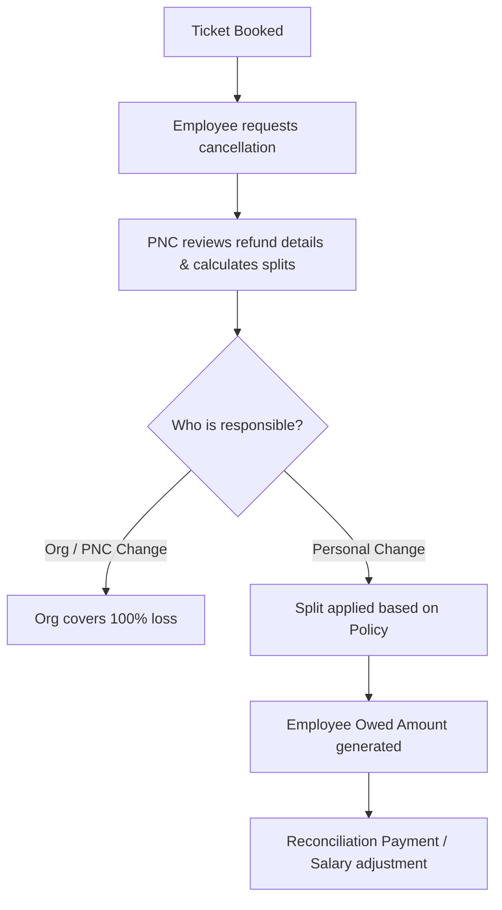

# Navgurukul Travel Desk — Employee Guide ✈️

Welcome to the **Navgurukul Travel Desk** application! This platform simplifies and streamlines your travel request, booking, and reimbursement processes. 

Whether you are requesting travel for a team visit, manager meetup, or the Igatpuri Meetup, this guide will walk you through the key features, workflows, and rules you need to know as an employee.

---

## 📌 Table of Contents
1. [Getting Started & Profile Verification](#1-getting-started--profile-verification)
2. [Submitting a Travel Request (Step-by-Step)](#2-submitting-a-travel-request-step-by-step)
3. [Understanding the Ticket Request Lifecycle](#3-understanding-the-ticket-request-lifecycle)
4. [Handling Rejections & Resubmissions](#4-handling-rejections--resubmissions)
5. [Responding to Info Requests (On Hold)](#5-responding-to-info-requests-on-hold)
6. [Cancellations & Reconciliation](#6-cancellations--reconciliation)
7. [PNC Support Chat (Beta)](#7-pnc-support-chat-beta)

---

## 1. Getting Started & Profile Verification

Before booking any travel, you must complete your profile and verify your identity. The system restricts travel bookings if your profile is incomplete to ensure safety, policy compliance, and smooth check-ins.

### Profile Completeness Checklist
Your profile has a completeness score. You must fill out **11 key fields** to reach 100% completeness:

1. **Full Name**
2. **Department** (Select from your organization's list)
3. **Campus Location**
4. **Manager's Name**
5. **Manager's Email Address** (Used for travel policy approvals)
6. **Phone Number** (Must be a valid 10-digit mobile number)
7. **Emergency Contact Name**
8. **Emergency Contact Phone** (Must be a valid 10-digit number)
9. **Emergency Contact Relation**
10. **Blood Group** (Select from A+, A-, B+, B-, O+, O-, AB+, AB-)
11. **Required Document Uploads**:
    * **Passport Size Photo** (Max file size: 5MB)
    * **Government ID Proof** (Aadhaar, Passport, PAN Card, Voter ID, or Driving License. Max size: 5MB)

> [!IMPORTANT]
> **Temporary Verification Unlock:** If you need to book travel urgently but your documents are still pending review by the PNC team, you can click **"Skip for Now"** on your dashboard. This temporarily unlocks the booking functionality for a limited window (defined by system policy, e.g., 7 days). After this grace period, you must complete verification to book again.

---

## 2. Submitting a Travel Request (Step-by-Step)

To request a ticket booking, click the **New Booking** button on your dashboard. The form has three guided steps:

### Step 1: Basic Information
* **Full Name & Email:** Pre-filled from your profile.
* **Phone Number & Department:** Pre-filled, but can be updated.
* **Purpose of Travel:** State a clear business reason (e.g., *Site visit to Pune*, *Partner Meeting*, or *Igatpuri Meetup*).
* **Approving Manager Name & Email:** Enter the manager who will receive notifications and approve this trip.
* **Mode of Travel:** Choose **Flight**, **Train**, or **Bus**.
* **Trip Type:** Select **One-way** or **Round-trip**.

### Step 2: Travel Logistics
* **Route details:** Fill in **From** and **To** cities/stations.
* **Departure Date:** Choose your travel date.
* **Preferred Departure Window:** Specify when you'd like to travel:
  * Morning (6AM - 12PM)
  * Afternoon (12PM - 6PM)
  * Evening (6PM - 12AM)
  * Anytime
* **Return Details:** (Only for Round-trip) Specify Return From/To, Return Date, and Return Time Window.

> [!WARNING]
> **Notice Period Policy Violations:** Each travel mode requires a minimum number of advance booking days (e.g., flights must be requested at least 14 days in advance). If your requested travel date violates this notice policy:
> 1. A warning card will appear: *"Policy Violation Detected"*.
> 2. You **must** enter a late booking justification/reason in the text area provided.
> 3. Your request will go to your manager for explicit approval before the PNC team can book it.

### Step 3: Personal & Emergency Details
* **Verify Emergency Contacts:** Confirm blood group, emergency contact details, and input any medical conditions or special assistance requirements (such as wheelchair access or dietary allergies).
* Once finalized, click **Submit**.

> [!TIP]
> **Igatpuri Meetup Visits:** If you are added to a finalized Igatpuri meetup list by your department head or coordinator, a green notification banner will appear on your dashboard. Simply click **Book Travel** on that banner, and your dates and purpose will be automatically prefilled for you!

---

## 3. Understanding the Ticket Request Lifecycle

Once submitted, your travel request moves through several stages. You can track this in real time from your dashboard, represented as a visual "Boarding Pass" card.

| Status | Meaning | What You Need to Do |
| :--- | :--- | :--- |
| **Not Started** | Request submitted. System checks for policy violations. | None. Auto-advances. |
| **Approval Pending** | Notice policy violation detected. | Waiting for your Manager to review and approve. |
| **Rejected by Manager** | Manager rejected the request. | Edit the details and resubmit (or cancel). |
| **Processing** | Manager approved (or no violations) and PNC is working on booking. | None. PNC is contacting vendors or searching fares. |
| **On Hold** | PNC requires more information from you to proceed. | Respond to the clarification request immediately. |
| **Rejected by PNC** | PNC rejected the request (e.g., budget limits, flight unavailable). | Edit and resubmit based on PNC feedback. |
| **Booked** | Ticket issued! Details (PNR, invoice, cost) are logged. | Download ticket/itinerary details from the dashboard card. |
| **Cancellation Requested**| You requested to cancel a booked ticket. | Waiting for PNC to process cancellation and refunds. |
| **Cancelled by Employee** | Ticket cancellation processed. | Reconcile any costs if determined as employee-owned. |
| **Closed** | Travel date passed and financial reconciliation is complete. | Done. |

---

## 4. Handling Rejections & Resubmissions

If your request is rejected by either your **Manager** or the **PNC team**:
1. You will receive an email and a notification.
2. The reason for rejection will be clearly stated inside your request details (e.g., *"Wrong travel dates"* or *"Please select Train instead of Flight"*).
3. If applicable, click **Edit & Resubmit** on the request card. This opens the travel request form prefilled with your previous choices. Correct the flagged details and submit.

> [!CAUTION]
> **Resubmission Limit:** You can resubmit a request a maximum of **3 times**. If your request is rejected 3 times, the button will lock. You must then contact the PNC team or your manager directly to resolve the issue manually.
> 
> *Note: Resubmitting always re-runs the violation check from scratch.*

---

## 5. Responding to Info Requests (On Hold)

If the PNC booking team runs into questions (e.g., *"The morning flight is sold out; is an afternoon flight okay?"* or *"Please share your middle name as per Aadhaar"*), they will put your request **On Hold**.

1. You will see a warning section on your ticket card saying **Action Required: Information Requested**.
2. Click on the card to open the **Request Details Overlay**.
3. Under the **PNC Clarification Needed** block, read their query.
4. Type your reply in the **Your Response** box.
5. Click **Submit Response & Resume Processing**. This clears the hold and updates the status back to **Processing** so PNC can book your ticket immediately.

---

## 6. Cancellations & Reconciliation

If your travel plans change and you need to cancel a ticket:

### Before Booking (Processing/Approval Pending/On Hold states)
Click **Cancel Request** in the Request Detail Overlay. The request will immediately transition to a terminal cancelled state with no cancellation penalty or organizational impact.

### After Booking (Booked state)
1. Open your request card and click **Cancel Request**.
2. Confirm the cancellation. The ticket status updates to **Cancellation Requested** and enters PNC's queue.
3. PNC will process the cancellation with the vendor and record refund percentages.

### Who Bears the Cost?
Depending on why you cancelled, the cost is split based on system policy rules:
* **Cancelled by PNC/Ops (Company's responsibility):** If the flight got cancelled by the airline or cancelled due to an ops change, the organization covers 100% of the cost.
* **Cancelled by Employee (Personal reasons):** If cancelled due to personal changes of plan, you may be responsible for a portion of the non-refundable fare or penalty, as determined by the system cancellation policy.

> [!NOTE]
> **Cancellations Dashboard:** You can track cancellation refunds, organization-absorbed costs, and any balance you owe to the organization through the **Cancellations Dashboard** in the app. If you owe money for a personal cancellation, this will stay open as `Pending Refund` until settled.

---

## 7. PNC Support Chat (Beta)

Have general travel questions or need to discuss your booking directly with the PNC team? Use the built-in **PNC Support Chat (Beta)**.

### Creating a Support Thread
1. Navigate to the Chat tab in your sidebar.
2. Click **Start New Chat**.
3. Choose what you need assistance with:
   * 🎟️ **Existing Request:** Select this if you have a question about a request you already submitted. The system will prompt you to select the booking from a dropdown list, linking your conversation directly to the ticket.
   * 📅 **Future Request:** Select this to ask about a trip you plan to make in the future.
   * ❓ **Others:** General travel desk queries, reimbursement policies, or feedback.
4. Send your message. PNC admins will see this in their support dashboard and reply.

### Chat Features
* **Real-time updates:** Exchange messages instantly with PNC.
* **Attachments:** You can upload and send images or documents (e.g. visa copies, special permission letters) directly inside the chat window.

---

*Thank you for helping us keep Navgurukul travel efficient and organized. Have a safe journey!* ✈️
