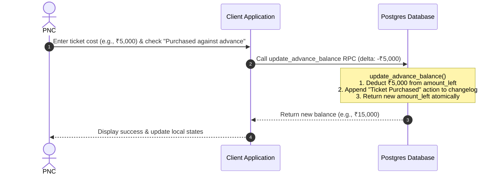
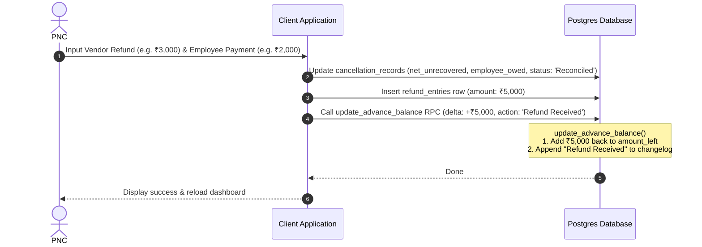

# PNC Advance & Cancellation Reconciliation Process Flows

This document outlines the state lifecycle and financial transaction flows for advances, ticket purchases, ticket cancellations, and refund settlements within the Travel Desk application.

---

## 1. Overview of the State Life Cycle

```mermaid
stateDiagram-hr
    [*] --> RequestSubmitted : Employee submits travel request
    RequestSubmitted --> Approved : Manager approves request
    Approved --> Booked : PNC books ticket & logs costs
    Booked --> CancellationRequested : Employee cancels booking
    CancellationRequested --> Cancelled : PNC processes cancellation
    Cancelled --> Reconciled : PNC settles refunds / employee repayments
    Reconciled --> [*]
```

---

## 2. Detailed Process Flows

### Flow 1: Advance Issuance & Booking Deduction
When an employee requires an advance for travel, or when tickets are purchased against an advance, the active balance changes atomically:

1. **Advance Received**: An advance record is created in the `advances` table (e.g. ₹20,000 balance).
2. **Ticket Purchase**:
   - PNC sets the request status to `Booked` / `Closed` and enters the final ticket cost.
   - For single tickets or split legs purchased against the advance:
     - The application invokes the atomic `update_advance_balance` database RPC.
     - Decrements `amount_left` by the ticket cost.
     - Appends a changelog entry (`'Ticket Purchased'`) noting the leg origin, destination, and booking details.



---

### Flow 2: Cancellation Submission (No Advance Balance Interaction Yet)
When a booked travel request needs to be cancelled:

1. **Employee Initiative**:
   - The employee clicks **Cancel Request** on their dashboard.
   - They confirm the cancellation (no leg-picking or fault toggling on employee side).
   - The status updates to `Cancellation Requested`.
2. **PNC Processing**:
   - The request surfaces in PNC's **Cancel Queue** tab.
   - PNC opens the request and clicks **Process Cancellation**.
   - PNC selects the target cancelled legs, assigns responsibility (Employee vs. Org), and inputs details.
   - A snapshot of the current cancellation policy is saved to the created `cancellation_records` row:
     - Policy percentages (`policy_navgurukul_cover_percent`, `policy_employee_cover_percent`)
     - Original fare and calculated splits (`net_unrecovered_amount`, `employee_owed_amount`, `org_absorbed_amount`)
     - The cancellation status becomes `Pending Refund`.
   - **Crucial**: The advance balance is *not* modified at this point.

---

### Flow 3: Refund & Settlement Reconciliation
When refunds are received from the vendor, or when the employee pays back their owed share:

1. **PNC Settles**:
   - PNC navigates to the **Cancellations** dashboard.
   - PNC clicks **Settle** on the cancellation record card.
   - PNC inputs the actual amounts recovered:
     - **Vendor Refund (₹)** (from the airline/railway vendor)
     - **Employee Payment (₹)** (repayment from the employee for their owed portion)
     - PNC selects the terminal status (e.g. `Reconciled` or `Fully Refunded` or `Written Off`).
2. **Database & Advance Credits**:
   - The `cancellation_records` row is updated with the new amounts and status.
   - The sum of recovered amounts (`vendorRefund + employeePayment`) is inserted as a row in `refund_entries` for auditing.
   - **Advance Credit**: If the cancellation record maps to an active advance (`advance_id`), the recovered amount is credited back using `update_advance_balance` (positive delta).
   - This appends a `'Refund Received'` changelog entry inside the advance record, ensuring the advance balances and the funds can be reused.


