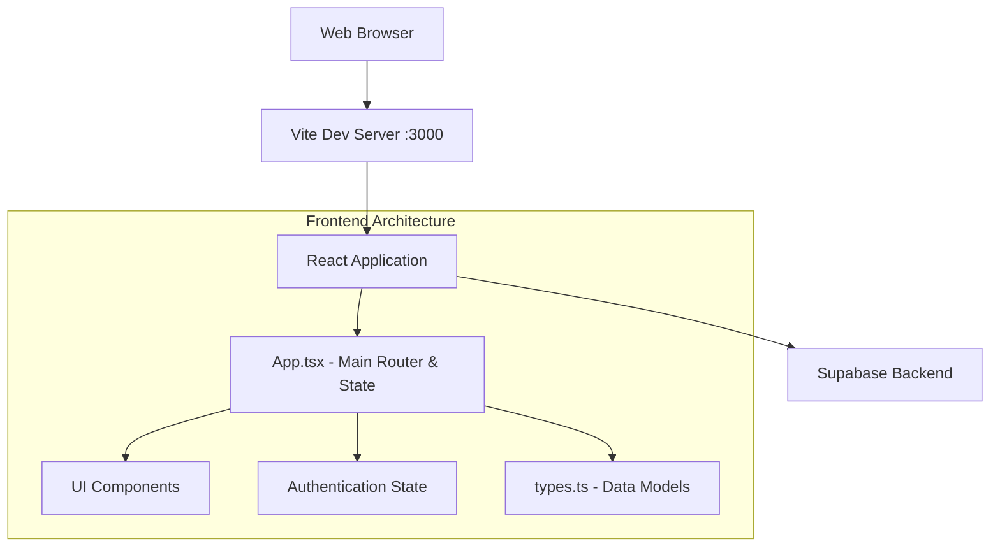
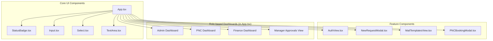
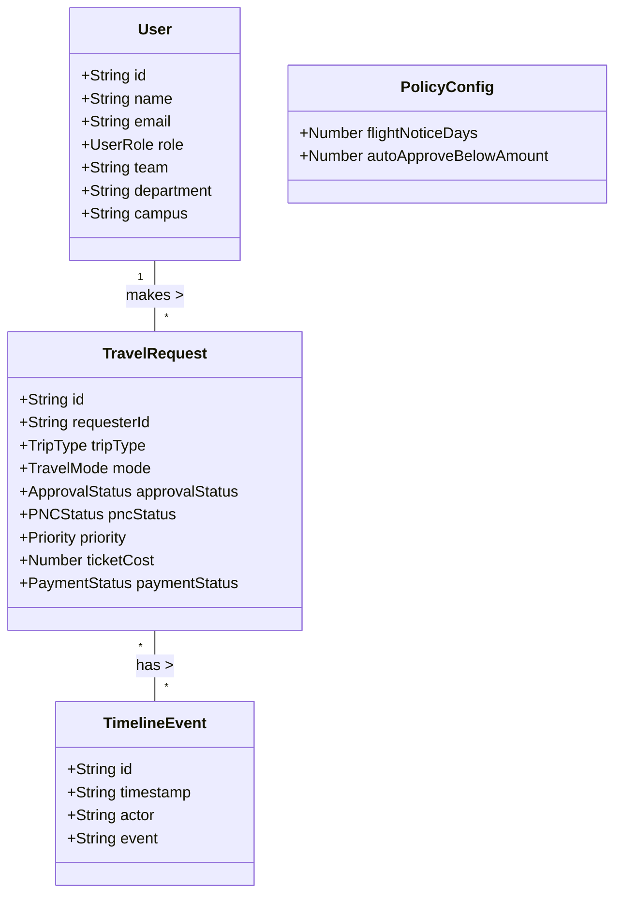
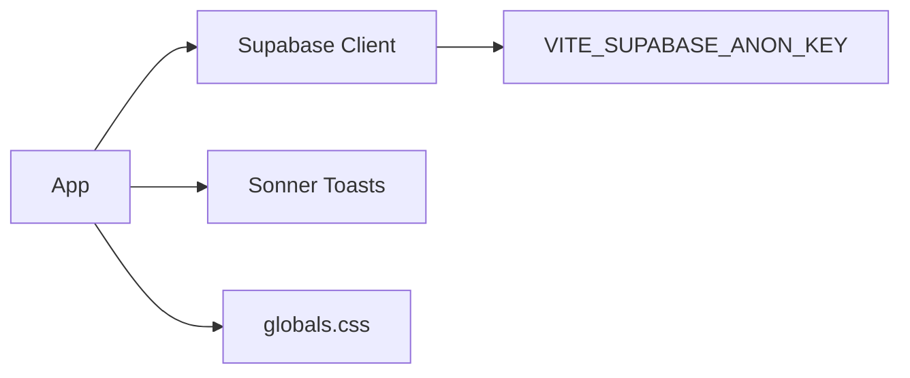

# Navgurukul Travel Desk - Knowledge Graph

This document provides a knowledge graph of the Navgurukul Travel Desk web application. It outlines the codebase structure, component relationships, data models, and external dependencies.

## Architecture Overview

The web application is a React-based Single Page Application (SPA) built with Vite, TypeScript, and Supabase for backend services (database, authentication, etc.).

## Component Relationships

The application is structured around a main `App.tsx` file that coordinates different dashboards based on user roles (Admin, PNC, Finance, Employee).

## Data Models (`types.ts`)

The application relies on several core TypeScript interfaces and enums to manage state and database interactions.

## Enums and Statuses

The workflow of a travel request is governed by several state machines defined as enums:

- **UserRole**: `Employee`, `PNC`, `Finance`, `Admin`
- **ApprovalStatus**: `Pending`, `Approved`, `Rejected`
- **PNCStatus**: `Not Started`, `Approval Pending`, `Rejected by Manager`, `Approved`, `Processing`, `Booked`, `Rejected by PNC`, `Closed`
- **PaymentStatus**: `Pending`, `Paid`, `Reimbursed`, `N/A`
- **TravelMode**: `Flight`, `Train`, `Bus`
- **TripType**: `One-way`, `Round-trip`
- **VerificationStatus**: `Incomplete`, `Pending Verification`, `Approved`, `Rejected`

## External Services & Config

- **Vite Config (`vite.config.ts`)**: Configures the dev server, proxies `/supabase-api` to a specific Cloudflare IP (`104.18.38.10`) for Supabase to bypass ISP DNS issues, and uses `@vitejs/plugin-react`.
- **Database (`supabaseClient.ts`)**: Initializes the Supabase client using environment variables.
- **Mock Data (`mockData.ts`)**: Provides initial dummy users and travel requests for development without a live backend.
