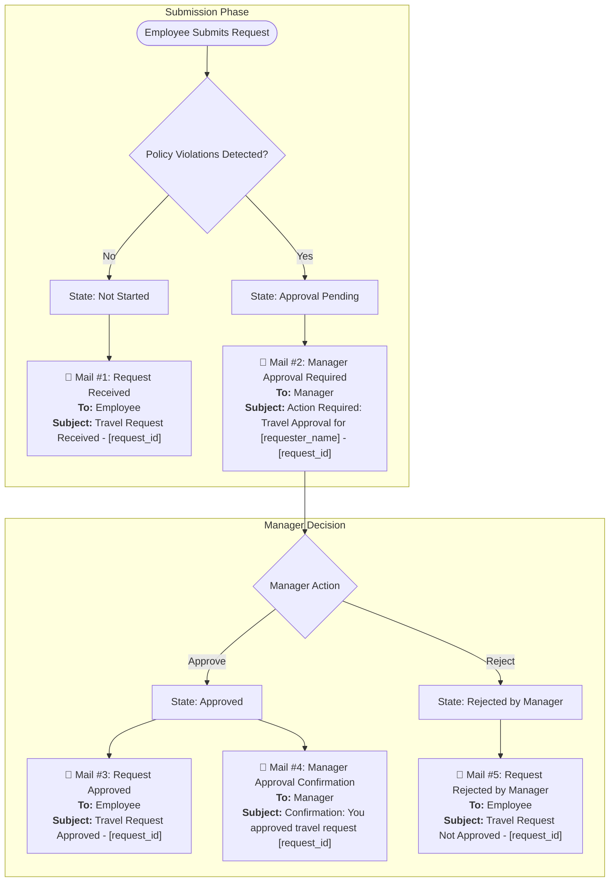
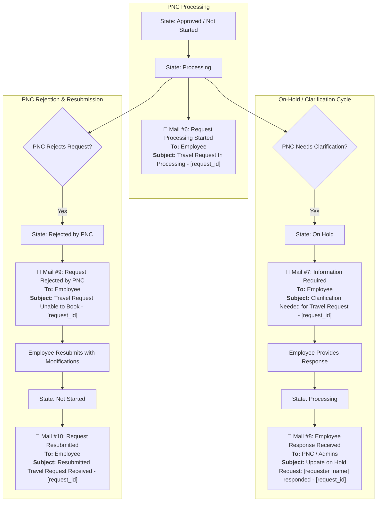
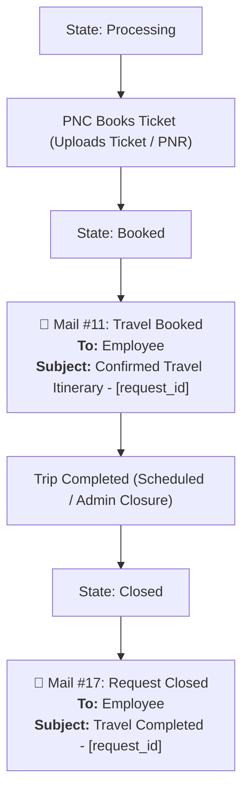
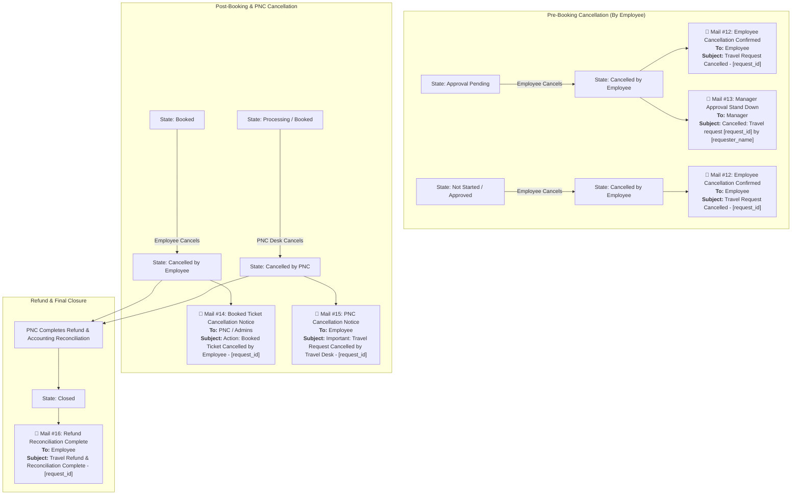
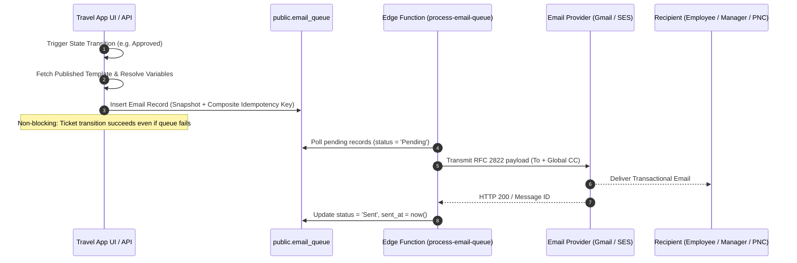

# Navgurukul Travel Desk — Transactional Mail Sender Routine

This document is the authoritative specification for all transactional email notifications sent by the Navgurukul Travel Desk application.

---

## 1. System Architecture & Lifecycle Flow

```text
Travel Lifecycle State Change
            ↓
queueEmailsForTransition (Asynchronous Side Effect)
            ↓
Fetch Published Mail Template (status = 'Published')
            ↓
Resolve Dynamic Template Variables & Global CC List
            ↓
Insert into public.email_queue (Snapshot Content + Idempotency Key)
            ↓
Supabase Edge Function (process-email-queue) / Cron Trigger
            ↓
Active Provider (Gmail API) → Future Provider (Amazon SES)
            ↓
Sent Mails & Delivery Log Tracking
```

### Production Invariant
Email generation and delivery are **strictly asynchronous side effects**. If template retrieval, variable resolution, or provider transmission encounters an error, the travel ticket state transition **always succeeds**.

---

## 2. Global CC Configuration

* **Default Global CC Addresses**:
  * `travel.team@navgurukul.org`
  * `nitin.s@navgurukul.org`
* **Configuration Storage**: Stored centrally in the `settings` database table under `setting_key = 'global_email_cc'`.
* **Resolution**: All automated lifecycle emails resolve the global CC list at queue time and attach it to `email_queue.cc`.

---

## 3. Supported Dynamic Template Variables

| Variable | Description | Example / Fallback |
| :--- | :--- | :--- |
| `{{request_id}}` | Unique formatted submission ID | `TRV-O-260828-001` |
| `{{submissionId}}` | Alias for request_id | `TRV-O-260828-001` |
| `{{requester_name}}` | Full name of requesting employee | `Anita Sharma` |
| `{{requester_email}}` | Work email of requester | `anita@navgurukul.org` |
| `{{manager_name}}` | Approving manager's name | `Rahul Verma` |
| `{{manager_email}}` | Approving manager's email | `rahul@navgurukul.org` |
| `{{origin}}` | Travel departure city/location | `Pune` |
| `{{destination}}` | Travel destination city/location | `Bangalore` |
| `{{from}}` | Alias for origin | `Pune` |
| `{{to}}` | Alias for destination | `Bangalore` |
| `{{departure_date}}` | Date of travel | `2026-09-15` |
| `{{dateOfTravel}}` | Alias for departure_date | `2026-09-15` |
| `{{travel_mode}}` | Mode of travel (Flight/Train/Bus) | `Flight` |
| `{{trip_type}}` | Trip type (One-way / Round-trip) | `One-way` |
| `{{purpose}}` | Purpose of travel | `Campus Annual Review` |
| `{{estimated_cost}}` | Estimated/booked ticket cost | `₹4,500` |
| `{{ticketCost}}` | Alias for estimated_cost | `4500` |
| `{{vendor_name}}` | Travel provider / airline / agency | `IndiGo` |
| `{{vendorName}}` | Alias for vendor_name | `IndiGo` |
| `{{violation_reasons}}` | Policy violation justification | `Flight notice < 15 days` |
| `{{rejection_reason}}` | Manager or PNC rejection reason | `Travel budget cap reached` |
| `{{information_requested}}` | Clarification question from PNC | `Please provide government ID` |
| `{{employee_response}}` | Employee response to clarification | `Aadhaar card attached` |
| `{{booking_reference}}` | PNR / Booking confirmation number | `IND-88219` |
| `{{cancellation_reason}}` | Stated reason for cancellation | `Meeting rescheduled by client` |
| `{{portal_url}}` | Portal link for user action | `https://travel.navgurukul.org` |

---

## 4. Complete Lifecycle Email Matrix

| # | Trigger Event | State Transition | Template Name | Audience | Primary Recipient | CC | Subject |
|---|---|---|---|---|---|---|---|
| **1** | Request Submitted (No Violation) | `Entry` → `Not Started` | `Request Received` | `employee` | `requesterEmail` | Global CC | `Travel Request Received - {{request_id}}` |
| **2** | Request Submitted (With Violation) | `Not Started` → `Approval Pending` | `Manager Approval Required` | `manager` | `approvingManagerEmail` | Global CC | `Action Required: Travel Approval for {{requester_name}} - {{request_id}}` |
| **3** | Manager Approval | `Approval Pending` → `Approved` | `Request Approved` | `employee` | `requesterEmail` | Global CC | `Travel Request Approved - {{request_id}}` |
| **4** | Manager Approval Confirmation | `Approval Pending` → `Approved` | `Manager Approval Confirmation` | `manager` | `approvingManagerEmail` | Global CC | `Confirmation: You approved travel request {{request_id}}` |
| **5** | Manager Rejection | `Approval Pending` → `Rejected by Manager` | `Request Rejected by Manager` | `employee` | `requesterEmail` | Global CC | `Travel Request Not Approved - {{request_id}}` |
| **6** | Processing Started | `Approved` / `Not Started` → `Processing` | `Request Processing Started` | `employee` | `requesterEmail` | Global CC | `Travel Request In Processing - {{request_id}}` |
| **7** | PNC Requests Info | `Processing` → `On Hold` | `Information Required` | `employee` | `requesterEmail` | Global CC | `Clarification Needed for Travel Request - {{request_id}}` |
| **8** | Employee Responds to Info | `On Hold` → `Processing` | `Employee Response Received` | `pnc` | Active PNC / Admins | Global CC | `Update on Hold Request: {{requester_name}} responded - {{request_id}}` |
| **9** | PNC Rejection | `Processing` → `Rejected by PNC` | `Request Rejected by PNC` | `employee` | `requesterEmail` | Global CC | `Travel Request Unable to Book - {{request_id}}` |
| **10** | Employee Resubmission | `Rejected` → `Not Started` | `Request Resubmitted` | `employee` | `requesterEmail` | Global CC | `Resubmitted Travel Request Received - {{request_id}}` |
| **11** | Ticket Booked | `Processing` → `Booked` | `Travel Booked` | `employee` | `requesterEmail` | Global CC | `✈️ Confirmed Travel Itinerary - {{request_id}}` |
| **12** | Employee Cancellation (Pre-booking) | `Any Pre-Booked` → `Cancelled by Employee` | `Employee Cancellation Confirmed` | `employee` | `requesterEmail` | Global CC | `Travel Request Cancelled - {{request_id}}` |
| **13** | Employee Cancellation (Manager Stand Down) | `Approval Pending` → `Cancelled by Employee` | `Manager Approval Stand Down` | `manager` | `approvingManagerEmail` | Global CC | `Cancelled: Travel request {{request_id}} by {{requester_name}}` |
| **14** | Employee Cancellation (Post-booking) | `Booked` → `Cancelled by Employee` | `Booked Ticket Cancellation Notice` | `pnc` | Active PNC / Admins | Global CC | `Action: Booked Ticket Cancelled by Employee - {{request_id}}` |
| **15** | PNC Cancellation | `Booked` / `Processing` → `Cancelled by PNC` | `PNC Cancellation Notice` | `employee` | `requesterEmail` | Global CC | `Important: Travel Request Cancelled by Travel Desk - {{request_id}}` |
| **16** | Refund / Reconciliation Complete | `Cancelled` → `Closed` | `Refund Reconciliation Complete` | `employee` | `requesterEmail` | Global CC | `Travel Refund & Reconciliation Complete - {{request_id}}` |
| **17** | Trip Completed & Closed | `Booked` → `Closed` | `Request Closed` | `employee` | `requesterEmail` | Global CC | `Travel Completed - {{request_id}}` |

---

## 5. Negative Cases & Guardrails

1. **No Violation on Entry**:
   * If a request is submitted within policy rules, it transitions directly to `Processing` (or `Not Started`).
   * **Guardrail**: Manager approval email is **NEVER** sent if there are no violations.
2. **Manager Rejection**:
   * If a manager rejects a request, only the `Request Rejected by Manager` email is sent.
   * **Guardrail**: Approval confirmation and PNC processing notifications are **NEVER** triggered.
3. **Cancellation while in `Approval Pending`**:
   * The employee receives cancellation confirmation.
   * The manager receives a "Stand Down / Cancelled" notice.
   * **Guardrail**: PNC does **NOT** receive an alert, as the request was never in the PNC queue.
4. **Cancellation while in `Processing`**:
   * The employee and PNC receive notifications.
   * **Guardrail**: The manager is **NOT** re-notified if approval was already completed earlier.
5. **Draft Templates**:
   * If a template is in `Draft` or `Archived` status, it is **NEVER** dispatched to live users.
   * The system logs a non-blocking diagnostic record in `email_queue` (`status = 'Failed'`, `last_error = 'Template unpublished'`).

---

## 6. Idempotency & Duplicate Prevention

To guarantee zero duplicate emails across retries, re-renders, or network spikes, each queued email uses a deterministic SHA-256 / composite idempotency key:

```text
idempotency_key = ticket:{request_id}:status:{to_status}:aud:{audience}:{sorted_recipients}
```

Supabase enforces uniqueness via:
```sql
CREATE UNIQUE INDEX idx_email_queue_idempotency 
ON public.email_queue (idempotency_key) 
WHERE idempotency_key IS NOT NULL;
```
If an identical event is triggered within the same lifecycle transition, the database safely ignores the duplicate insert.

---

## 7. Visual Lifecycle & Email Flow Diagrams

### 7.1 Submission & Manager Approval Flow (Mails #1 – #5)



### 7.2 PNC Processing & Clarification Loop (Mails #6 – #10)



### 7.3 Booking & Completion Flow (Mails #11 & #17)



### 7.4 Cancellation & Refund Reconciliation Flows (Mails #12 – #16)



### 7.5 Asynchronous Delivery Sequence



